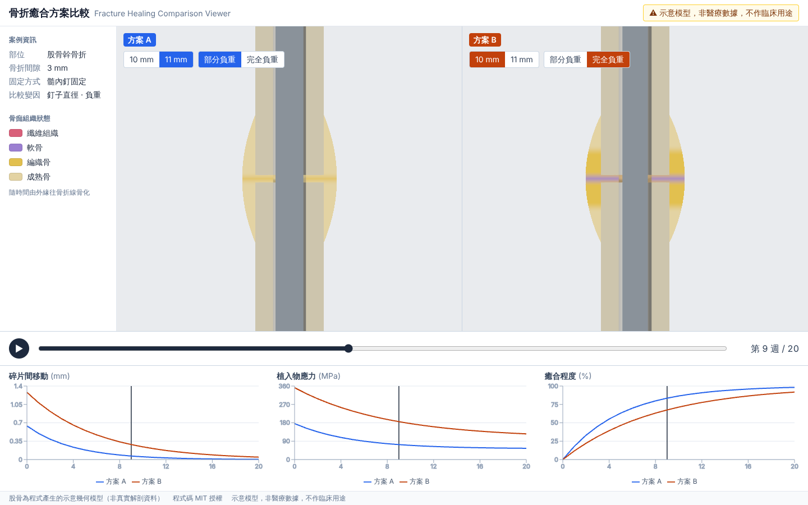
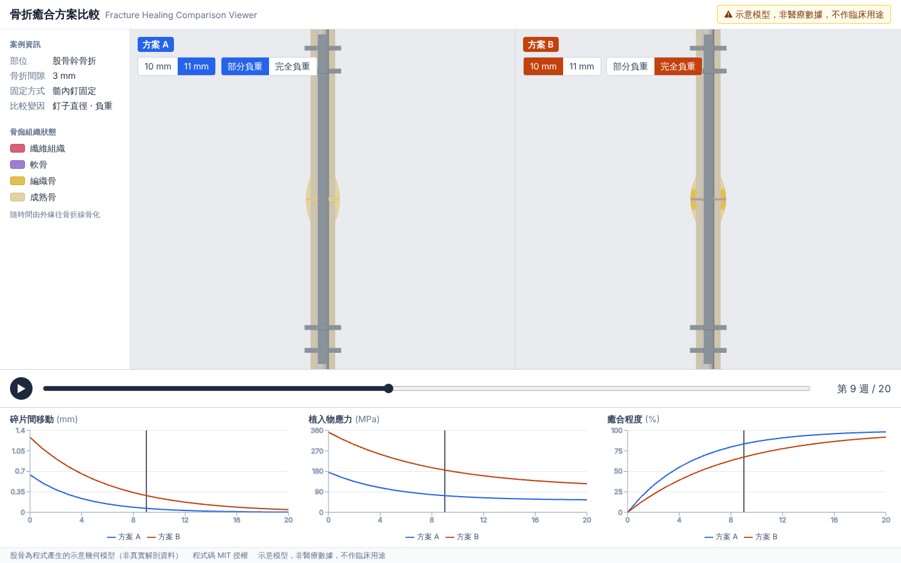

# fracture-healing-viewer · 骨折癒合方案比較

Browser-based 3D viewer comparing two fixation scenarios for the same femoral shaft fracture over 20 weeks of callus healing. Drag the timeline to watch the callus grow and ossify, switch nail diameter or loading per side, and read the key metrics in linked charts.

> **示意模型，非醫療數據，不作臨床用途.** Illustrative model only. Not medical data, not for clinical use.

**Demo:** _URL added after the Vercel project is connected (see [docs/DEPLOY.md](docs/DEPLOY.md))._





## What it does

- **A/B cross-sections** of the same fracture (3 mm gap, intramedullary nail), drawn side by side with linked cameras.
- **Timeline** week 0–20 with play/pause. Keys: `Space` play/pause, `←` / `→` one week.
- **Per-side scenario controls**: nail Ø 10 / 11 mm × partial / full weight bearing.
- **Callus shader**: grows, ossifies from the callus ends toward the fracture line (fibrous → cartilage → woven → mature bone), then remodels.
- **Three linked charts**: interfragmentary movement (mm), implant stress (MPa), consolidation (%). The cursor follows the timeline; clicking a chart jumps to that week.

## Technical decisions

Each decision has an ADR in [docs/adr](docs/adr). Plain-language notes and quiz questions per ticket are in [docs/LEARNING.md](docs/LEARNING.md).

| Decision                            | Choice                                    | Why                                                                                                                                                                                                |
| ----------------------------------- | ----------------------------------------- | -------------------------------------------------------------------------------------------------------------------------------------------------------------------------------------------------- |
| React Three Fiber vs plain three.js | R3F + drei                                | 3D and UI share React state; three.js objects are still reachable when needed                                                                                                                      |
| One canvas + `View` vs two canvases | One canvas                                | One WebGL context; the model and materials load once ([0013](docs/adr/0013-ab-views-camera-sync.md))                                                                                               |
| Precomputed vs live formulas        | Precomputed `scenarios.json`              | Mirrors a real product: simulation runs elsewhere, the browser presents ([0012](docs/adr/0012-scenarios-json-generation.md))                                                                       |
| Section: clipping vs transparency   | Clipping + stencil cap                    | Transparency has sorting issues and hides the inside; a cross-section is familiar to surgeons ([0006](docs/adr/0006-section-cap-stencil.md), [0007](docs/adr/0007-section-plane-fixed-coronal.md)) |
| Week / scenario change              | Shader uniforms only, no geometry rebuild | Keeps scenario switching within one frame ([0008](docs/adr/0008-nail-and-locking-screws.md), [0009](docs/adr/0009-callus-growth-and-tissue-state.md))                                              |
| State                               | Zustand                                   | One store for week, playback, A/B parameters and the shared camera pose                                                                                                                            |
| Charts / styling / hosting          | Recharts · Tailwind · Vercel              | [0015](docs/adr/0015-charts-recharts.md), [0010](docs/adr/0010-styling-tailwind.md), [0016](docs/adr/0016-deploy-vercel-and-ci.md)                                                                 |

## Illustrative data model

4 scenarios (2 nail diameters × 2 loadings) × weeks 0–20, generated by [`src/data/generateScenarios.ts`](src/data/generateScenarios.ts) from [`healingModel.ts`](src/data/healingModel.ts):

- k_nail = 1.0 (10 mm) / 1.25 (11 mm); k_load = 1.0 (partial) / 1.6 (full)
- IFM(t) = 0.8 · k_load / k_nail · e^(−t/τ)
- C(t) = 100 · (1 − e^(−t/τc))
- σ(t) = 220 · k_load / k_nail · (1 − 0.7 · C(t)/100)
- Initial IFM > 1.1 mm → delayed healing (τ = 6, τc = 8), otherwise τ = 4, τc = 5 ([0001](docs/adr/0001-delayed-healing-threshold.md)). Only 10 mm + full loading is delayed.

The numbers only aim for plausible trends.

## Run locally

Node 22.18+ and pnpm 10 (`corepack enable`).

```sh
pnpm install
pnpm dev          # http://localhost:5173
pnpm check        # lint, format check, type check, tests, build
```

## Project structure

```
src/
  scene/     ComparisonViews, FractureScene, FemurModel, Nail, Callus, section capping
  shaders/   callus.vert / .frag, cap and stencil shaders, shared tissue.glsl
  charts/    MetricChart(s)
  ui/        CasePanel, Timeline, ScenarioControls, Legend, Disclaimer, Footer
  store/     useViewerStore (Zustand), timeline and camera-pose logic
  data/      healingModel, generateScenarios, scenarios.json
scripts/     placeholder femur GLB generator, scenarios.json writer
public/models/femur.glb
docs/        PRD, ADRs, LEARNING, DEPLOY
```

## Data sources and licences

- **Code:** MIT, see [LICENSE](LICENSE).
- **Femur model:** currently a **generated placeholder** (two hollow tubes with a 3 mm gap; [ADR 0005](docs/adr/0005-placeholder-femur-model.md)). The planned replacement is the BodyParts3D right femur (FMA24474), © The Database Center for Life Science, licensed CC BY-SA 2.1 Japan; the modified GLB would be released under the same licence. The page and this README will credit it once it replaces the placeholder.
- This is an independent portfolio project and uses no company names or branding.
